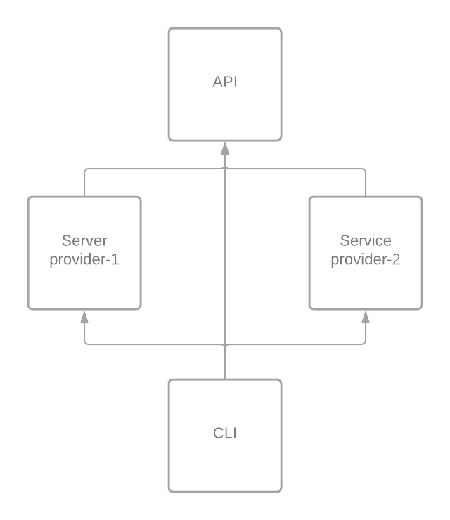

# Java module - example project

## Java without Module

* Statements > Methods > Classes > Packages > Jar
* All the public classes are accessible outside the packages
* No control access for public classes
* No idea which class uses what in the world

## Java with Module

* Next Level of Abstraction for Java
    * Statements > Methods > Classes > Packages > Module > Jar
* Groups related packages
* A module has a name, it groups related code and is self-contained
* Declare and describe dependencies
* Cyclic dependencies not allowed

## Jar files and the classpath

* JVM loads all the classes in the classpath
* doesn't describe dependencies

## Why?

* Understandability: clear and explicit dependencies
* Ease to maintain in the long run
* Provides flexibility to decouple different parts of the system
* Provides strong encapsulation: hind the API internals
* Explicit dependencies

## How To-do's

* How to list java modules? `java --list-modules`
* How to describe java modules? `java --describe-module java.sql`

## Demo:

Example module dependency



## Before adding module-info

```shell
cd mo-child-api
mvn clean package
java -cp target/mo-child-api-1.0-SNAPSHOT.jar com.test.mo_child_api.App
```

```shell
jar tf mo-child-api/target/mo-child-api-1.0-SNAPSHOT.jar
jar tf mo-child-cli/target/mo-child-cli-1.0-SNAPSHOT.jar

java -cp mo-child-api/target/mo-child-api-1.0-SNAPSHOT.jar com.test.mo_child_api.App
java -cp mo-child-cli/target/mo-child-cli-1.0-SNAPSHOT.jar com.test.mo_child_cli.App
```

## After adding module-info to `mo-child-api`

```shell
 mvn clean package
 #Running using module-path 
 java --module-path mo-child-api/target/mo-child-api-1.0-SNAPSHOT.jar -m mod_api/com.test.mo_child_api.App
 #Running using class-path
 java -cp mo-child-api/target/mo-child-api-1.0-SNAPSHOT.jar com.test.mo_child_api.App 
```

#### Describe `mod_api` module

```shell
jar --describe-module --file=mo-child-api/target/mo-child-api-1.0-SNAPSHOT.jar
```

#### Add `java.logging` module

* requires

#### Export a packages

* `exports com.test.mo_child_api.api`

#### Describe `mod_api` module

```shell
jar --describe-module --file=mo-child-api/target/mo-child-api-1.0-SNAPSHOT.jar
```

## Adding require `api_mode` to `mo-child-service-impl-1`

```shell
 mvn clean package
 #Running using module-path - missing api_mode  
 java --module-path mo-child-service-impl-1/target/mo-child-service-impl-1-1.0-SNAPSHOT.jar -m mo.child.service.impl_1/com.test.mo_child_service_impl_1.App
 #Running using module-path
 java --module-path mo-child-service-impl-1/target/mo-child-service-impl-1-1.0-SNAPSHOT.jar:mo-child-api/target/mo-child-api-1.0-SNAPSHOT.jar -m mo.child.service.impl_1/com.test.mo_child_service_impl_1.App

 #Running using class-path
 java -cp mo-child-api/target/mo-child-api-1.0-SNAPSHOT.jar:mo-child-service-impl-1/target/mo-child-service-impl-1-1.0-SNAPSHOT.jar com.test.mo_child_service_impl_1.App 
```

Note:

* Show if we can use Person class from `api_mode`
* Show if we can use Java-Reflection API from `api_mode`
* Show `opens` vs `exports` and `open` modules
* Qualified exports: with `opens to <mod-name>,<mod-name>` and `exports to <mod-name>,<mod-name>`
* describe module

```shell
jar --describe-module --file=mo-child-api/target/mo-child-api-1.0-SNAPSHOT.jar
jar --describe-module --file=mo-child-service-impl-1/target/mo-child-service-impl-1-1.0-SNAPSHOT.jar
```

* module resolution

```shell
java --show-module-resolution -p mo-child-api/target/mo-child-api-1.0-SNAPSHOT.jar -m mod_api
java --show-module-resolution -p mo-child-service-impl-1/target/mo-child-service-impl-1-1.0-SNAPSHOT.jar:mo-child-api/target/mo-child-api-1.0-SNAPSHOT.jar -m mo.child.service.impl_1/com.test.mo_child_service_impl_1.App

java --show-module-resolution -cp mo-child-api/target/mo-child-api-1.0-SNAPSHOT.jar:mo-child-service-impl-1/target/mo-child-service-impl-1-1.0-SNAPSHOT.jar com.test.mo_child_service_impl_1.App
```

## Adding require `api_mode` to `mo-child-service-impl-2`

```shell
 mvn clean package
 #Running using module-path - missing api_mode  
 java --module-path mo-child-service-impl-2/target/mo-child-service-impl-2-1.0-SNAPSHOT.jar -m mo.child.service.impl_2/com.test.mo_child_service_impl_2.App
 #Running using module-path
 java --module-path mo-child-service-impl-2/target/mo-child-service-impl-2-1.0-SNAPSHOT.jar:mo-child-api/target/mo-child-api-1.0-SNAPSHOT.jar -m mo.child.service.impl_2/com.test.mo_child_service_impl_2.App

 #Running using class-path
 java -cp mo-child-api/target/mo-child-api-1.0-SNAPSHOT.jar:mo-child-service-impl-2/target/mo-child-service-impl-2-1.0-SNAPSHOT.jar com.test.mo_child_service_impl_2.App 
```

## Services

* Loose coupling

#### Add `provides with` to mo-child-service-impl-1's `module-info`

#### Add `provides with` to mo-child-service-impl-2's `module-info`

#### Add `uses ` to mo-child-cli's `module-info`

```shell
 #Running using module-path using service-1 impl
 java --module-path mo-child-service-impl-1/target/mo-child-service-impl-1-1.0-SNAPSHOT.jar:mo-child-api/target/mo-child-api-1.0-SNAPSHOT.jar:mo-child-cli/target/mo-child-cli-1.0-SNAPSHOT.jar -m mod_cli_x/com.test.mo_child_cli.App
 #Running using module-path using service-2 impl
 java --module-path mo-child-service-impl-2/target/mo-child-service-impl-2-1.0-SNAPSHOT.jar:mo-child-api/target/mo-child-api-1.0-SNAPSHOT.jar:mo-child-cli/target/mo-child-cli-1.0-SNAPSHOT.jar -m mod_cli_x/com.test.mo_child_cli.App
 #Running using module-path using service-1 and service-2 impl
 java --show-module-resolution --module-path mo-child-service-impl-1/target/mo-child-service-impl-1-1.0-SNAPSHOT.jar:mo-child-service-impl-2/target/mo-child-service-impl-2-1.0-SNAPSHOT.jar:mo-child-api/target/mo-child-api-1.0-SNAPSHOT.jar:mo-child-cli/target/mo-child-cli-1.0-SNAPSHOT.jar -m mod_cli_x/com.test.mo_child_cli.App

 #Running using class-path 
 java -cp mo-child-service-impl-2/target/mo-child-service-impl-2-1.0-SNAPSHOT.jar:mo-child-api/target/mo-child-api-1.0-SNAPSHOT.jar:mo-child-cli/target/mo-child-cli-1.0-SNAPSHOT.jar com.test.mo_child_cli.App

```
Notes: 
* describe module

```shell
jar --describe-module --file=mo-child-cli/target/mo-child-cli-1.0-SNAPSHOT.jar
```

### Jdeps

```shell
# Summary
jdeps -s mo-child-cli/target/mo-child-cli-1.0-SNAPSHOT.jar mo-child-api/target/mo-child-api-1.0-SNAPSHOT.jar mo-child-service-impl-1/target/mo-child-service-impl-1-1.0-SNAPSHOT.jar
# Verbose
jdeps mo-child-cli/target/mo-child-cli-1.0-SNAPSHOT.jar mo-child-api/target/mo-child-api-1.0-SNAPSHOT.jar mo-child-service-impl-1/target/mo-child-service-impl-1-1.0-SNAPSHOT.jar
 
```

## Jlink

```shell
rm -rf meme
#Without services
jlink --module-path mo-child-cli/target/mo-child-cli-1.0-SNAPSHOT.jar:mo-child-api/target/mo-child-api-1.0-SNAPSHOT.jar --add-modules mod_cli_x --output meme

#With services
rm -rf meme
jlink --module-path mo-child-cli/target/mo-child-cli-1.0-SNAPSHOT.jar:mo-child-api/target/mo-child-api-1.0-SNAPSHOT.jar:mo-child-service-impl-1/target/mo-child-service-impl-1-1.0-SNAPSHOT.jar:mo-child-service-impl-2/target/mo-child-service-impl-2-1.0-SNAPSHOT.jar --add-modules mod_cli_x --output meme
jlink --module-path mo-child-cli/target/mo-child-cli-1.0-SNAPSHOT.jar:mo-child-api/target/mo-child-api-1.0-SNAPSHOT.jar:mo-child-service-impl-1/target/mo-child-service-impl-1-1.0-SNAPSHOT.jar:mo-child-service-impl-2/target/mo-child-service-impl-2-1.0-SNAPSHOT.jar --add-modules mod_cli_x,mo.child.service.impl_1,mo.child.service.impl_2 --output meme

```

#### Running custom java runtime

```shell
./meme/bin/java --module mod_api/com.test.mo_child_api.App
./meme/bin/java --module mod_cli_x/com.test.mo_child_cli.App
```

### Creating custom launcher

```shell
rm -rf meme
jlink --launcher customjrelauncher=mod_cli_x/com.test.mo_child_cli.App --module-path mo-child-cli/target/mo-child-cli-1.0-SNAPSHOT.jar:mo-child-api/target/mo-child-api-1.0-SNAPSHOT.jar:mo-child-service-impl-1/target/mo-child-service-impl-1-1.0-SNAPSHOT.jar:mo-child-service-impl-2/target/mo-child-service-impl-2-1.0-SNAPSHOT.jar --add-modules mod_cli_x,mo.child.service.impl_1,mo.child.service.impl_2 --output meme

./meme/bin/customjrelauncher 
```
